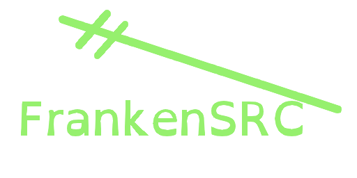

# FrankenSRC
a bunch of iglus to make using iglunix nicer for me and other users.

## FrankenSRC build.sh guidelines
FrankenSRC uses many template files from iglunix/iglunix, for convinience. Most build systems have a template, 
 however, any [GNU Software](https://www.gnu.org/software/software.en.html) must use the bad.build.sh template.

## Building Iglus
I would recommend cloning this git repo into /opt/FrankenSRC and iglunix/iglunix into /opt/src.
This provides a good seperation of the two repos. You should also generate your own RSA key using 
openssl or ssh-keygen  FrankenSRC's iglus are all in one folder, so switch into whichever package
folder you need to `cd` and:
	

   
Maintain Repo Manually

1. run ``Iglupkg fbp``
2. copy xbps package from out to your repo dir
3. create repository: ``xbps-rindex -fa /path/to/dir/*.xbps``
4. sign repository: ``xbps-rindex --sign --signedby 'Igluser <iglu@iglunix.org>' --privkey <your RSA key> /path/to/dir/``

or, run local-iglu from anoraktrend/local-iglu in the package folder to simplify the process of making a local repo. 
